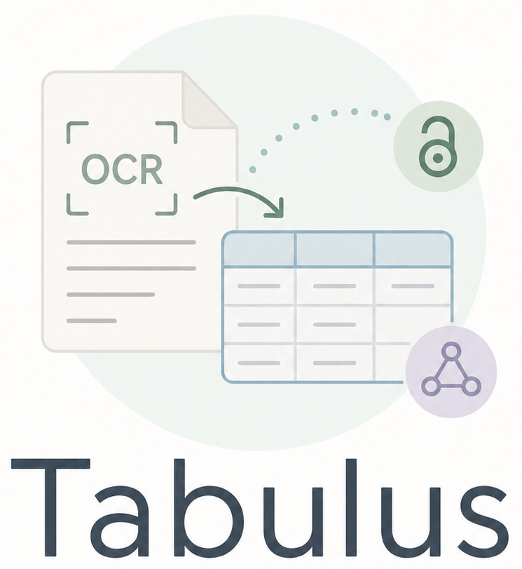

<p align="center">
  
</p>

# 📚 Tabulus: Scientific PDF Table Extraction Pipeline

<p align="center">
  <a href="https://tabulus.readthedocs.io/en/latest/">
    
  </a>
  <a href="https://doi.org/10.5281/zenodo.20741284">
    
  </a>
</p>


## 🔍 Overview
Tabulus is a modular multi-stage pipeline for extracting structured table data from scientific PDF documents.

The system combines document analysis, OCR, bibliography extraction, reference matching, and DOI enrichment into a unified workflow that transforms scientific publications into machine-readable data suitable for further analysis, knowledge graph integration, and research evaluation.

The project was developed as part of a Master's thesis investigating scientific table extraction, OCR benchmarking, bibliography-aware processing, and structured scholarly knowledge extraction.

---

## ✨ Features

### 📄 Scientific Table Extraction

* Automated table detection from scientific PDFs
* Table cropping and preprocessing
* OCR-based table reconstruction
* Structured CSV generation

### 🔗 Bibliography-Aware Processing
* Automatic reference table detection
* Bibliography extraction from full publications
* Reference matching between tables and bibliography entries
* DOI enrichment using Crossref

### 📊 Research & Evaluation
* OCR benchmarking framework
* RMS-based table similarity evaluation
* Precision, Recall, and F1-score analysis
* Runtime benchmarking
* Reproducible evaluation workflows

### 🏗️ System Design
* Modular microservice architecture
* REST-based communication
* Docker deployment
* GPU-accelerated OCR support
* Interactive web interface

---

## ⚙️ Pipeline Workflow
```text
Scientific PDF
      ↓
MinerU Table Detection
      ↓
Table Cropping
      ↓
OCR Extraction
(implemented: PaddleOCR-VL, Chandra OCR, NuExtract3; future: DeepSeek OCR)
      ↓
Reference Table Detection
      ↓
Bibliography Extraction
(GROBID / Kreuzberg + Regex)
      ↓
Reference Matching
      ↓
Crossref DOI Resolution
      ↓
Enriched CSV Generation
      ↓
Interactive Visualization UI
```

---

## 📁 Repository Structure
```text
tabulus/
│
├── assets/
│   ├── img/
│   └── logo.png
│
├── dataset/
│   └── README.md
│
├── evaluation/
│   ├── deplot/
│   ├── new_results/
│   ├── plots/
│   │   ├── reference_extraction/
│   │   ├── scripts/
│   │   └── table_extraction/
│   ├── scripts/
│   └── README.md
│
├── src/
│   ├── ocr_models/
│   │   ├── components/
│   │   │   ├── deepseekOCR2/
│   │   │   ├── Kreuzberg/
│   │   │   ├── mineru_service/
│   │   │   ├── NuExtract3/
│   │   │   └── paddleOCR_VL/
│   │   ├── KISSKI/
│   │   │   ├── Chandra/
│   │   │   └── NuExtract3/
│   │   ├── runners/
│   │   └── README.md
│   │
│   └── Tabulus/
│       ├── backend/
│       ├── kreuzberg_service/
│       ├── mineru_service/
│       ├── paddleocr_service/
│       ├── ui_input/
│       ├── docker-compose.yml
│       └── README.md
│
├── .gitignore
├── LICENSE
├── README.md
└── requirements.txt
```

---

## 🧩 Main Components
| Component        | Purpose                                                    |
| ---------------- | ---------------------------------------------------------- |
| `src/Tabulus`    | Complete production pipeline                               |
| `src/ocr_models` | OCR services, runners, and benchmarking components         |
| `evaluation`     | Evaluation scripts, metrics, and visualizations            |
| `dataset`        | Benchmark dataset documentation and ground-truth structure |
| `assets`         | Images and visual resources used in the documentation      |

Detailed documentation for each component is available in the corresponding README files.

---

## 🤖 OCR Technologies
The rebuilt Tabulus library currently integrates several OCR and document understanding approaches, with additional candidates retained for evaluation:

* MinerU
* PaddleOCR-VL
* Chandra OCR
* NuExtract3
* DeepSeek OCR 2 (future candidate)
* GROBID (legacy/reference-processing context)

---

## 🗄️ Dataset
The project uses a manually curated evaluation dataset containing:

* scientific publications,
* annotated tables,
* bibliography references,
* OCR outputs,
* DOI matching results,
* evaluation metrics.

The complete dataset exceeds 700 MB and is distributed separately.

See:

```text
dataset/README.md
```

for details.

---

## 📈 Evaluation
A comprehensive evaluation framework is included for analyzing:

* table extraction quality,
* OCR robustness,
* bibliography extraction performance,
* reference matching accuracy,
* DOI enrichment quality,
* runtime efficiency.

Generated benchmark plots and visualizations are available in:

```text
evaluation/plots/
```

See:

```text
evaluation/README.md
```

for detailed documentation.

---

## 🚀 Running the Pipeline
### 📋 Prerequisites
* Docker Desktop
* Docker Compose
* Python 3.11+
* NVIDIA GPU with CUDA support, recommended for OCR models

### ▶️ Start All Services
Navigate to the final pipeline folder:

```bash
cd src/Tabulus
```

Start the services:

```bash
docker compose up --build
```

This command starts:

* Frontend UI
* Backend API
* MinerU Service
* PaddleOCR-VL Service
* Kreuzberg OCR Service

After startup, the web interface can be accessed through the browser.

---

## 📖 Documentation
Additional documentation is available in:

```text
src/Tabulus/README.md
src/ocr_models/README.md
evaluation/README.md
dataset/README.md
```

Each README contains detailed setup instructions, implementation details, API documentation, evaluation procedures, and usage examples.

---

## 🎓 Research Context
This repository accompanies a Master's thesis focused on:

* scientific table extraction,
* OCR benchmarking,
* bibliography-aware table processing,
* DOI enrichment,
* structured scientific knowledge extraction,
* reproducible research workflows.

---

## 📑 Citation
If you use this repository in your research, please cite the associated Master's thesis.

Citation information will be added after publication.

---

## 📜 License
This project is provided for research and educational purposes.
