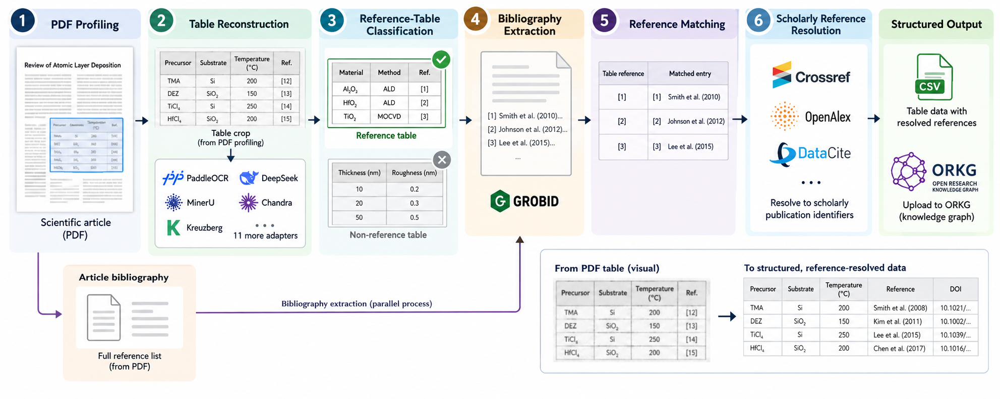

# Tabulus

**Scientific PDF Table Extraction Pipeline**

## About Tabulus

Tabulus is a modular pipeline for digitizing scientific PDF papers into
structured, reference-aware table data.



The rebuilt library is organized around standalone commands and explicit
filesystem contracts. The current rebuilt library covers PDF profiling,
canonical table-crop export, table reconstruction, reference-table
classification, GROBID-backed bibliography extraction, deterministic
reference matching, Step 6 paper-level scholarly reference resolution, and
Step 7 resolved CSV export. Run reports and complete `tabulus run`
orchestration remain planned in this checkout. Bibliography extraction is a
parallel PDF-level branch that produces `references/bibliography.json`, not a
consumer of MinerU table crops or reconstruction prediction CSVs.

Start with the locally verified commands, then use the linked pages for setup and adapter
details. For one PDF:

```bash
tabulus profile --pdf /path/to/paper.pdf --backend pipeline

tabulus reconstruct-tables \
  --crops /path/to/tabulus-output/table-crops/<paper> \
  --adapter <adapter> \
  --device gpu:0

tabulus classify-reference-tables \
  --reconstruction /path/to/tabulus-output/table-crops/<paper>/reconstructions/<adapter>

tabulus extract-bibliography \
  --pdf /path/to/paper.pdf \
  --out /path/to/artifact-root \
  --grobid-url http://localhost:8070

tabulus match-references \
  --selected /path/to/selected_reference_tables.json \
  --bibliography /path/to/artifact-root/references/bibliography.json

tabulus resolve-references \
  --bibliography /path/to/artifact-root/references/bibliography.json \
  --reference-matches /path/to/reconstruction/references/reference_matches.json \
  --out /path/to/artifact-root

tabulus export-resolved-csv \
  --reference-matches /path/to/reconstruction/references/reference_matches.json \
  --reference-resolution /path/to/artifact-root/references/reference_resolution.json
```

For several PDFs in one folder:

```bash
tabulus profile \
  --folder /path/to/papers \
  --backend hybrid-engine \
  --method auto \
  --effort high

tabulus reconstruct-tables \
  --crops-folder /path/to/papers/tabulus-output/table-crops \
  --adapter <adapter> \
  --device gpu:0

tabulus classify-reference-tables \
  --crops-folder /path/to/papers/tabulus-output/table-crops \
  --adapter <adapter>
```

## How To Use This Documentation

Start with the installation page that matches your machine. Windows and
CPU-only users can use MinerU's `pipeline` backend. GPU-server users can use
MinerU's `hybrid-engine` backend and adapter-specific reconstruction
environments when a suitable CUDA GPU is visible. Library contributors can use
the core Python setup for GPU-independent unit tests.

For the current adapter list and command examples, see
{doc}`tutorial/08-table-ocr`.

## Where To Start

::::{grid} 1 1 2 2
:gutter: 2

:::{grid-item-card} CPU / Windows Setup
:link: installation/windows-cpu
:link-type: doc

Use Python 3.12, a standard venv, CPU-only PyTorch, and MinerU `pipeline`.
:::

:::{grid-item-card} GPU Server Setup
:link: installation/gpu-server
:link-type: doc

Request GPU resources, install step-specific environments, and run MinerU or
Step 2 reconstruction adapters.
:::

:::{grid-item-card} Install The Python Library
:link: installation/python-library
:link-type: doc

Install Tabulus for core library development and run GPU-independent unit tests.
:::

:::{grid-item-card} Run MinerU On GPU
:link: workflows/mineru-gpu-execution
:link-type: doc

Use the tested MinerU 3.4.5 command sequence and validate the output with `discover_tables`.
:::

:::{grid-item-card} Follow The Core Tutorial
:link: tutorial/00-overview
:link-type: doc

Read the current runnable steps and artifact flow.
:::

::::

## Documentation Map

The sidebar contains the full documentation. The main sections are:

- **Installation And Setup:** Windows CPU, GPU server, and Python library setup.
- **Tutorial:** the intended modular workflow, one processing step at a time.
- **Components:** adapter boundaries and responsibilities.
- **Workflows:** headless local/GPU execution shapes.
- **External Tools:** third-party tools as used by Tabulus.
- **Data Contracts:** the file formats and artifact layers exchanged between modules.
- **Evaluation:** how to compare extraction and matching quality.

```{toctree}
:hidden:
:maxdepth: 3

installation/index
tutorial/index
modules/index
workflows/index
external-tools/index
data-contracts/index
evaluation/index
project-notes/index
```
