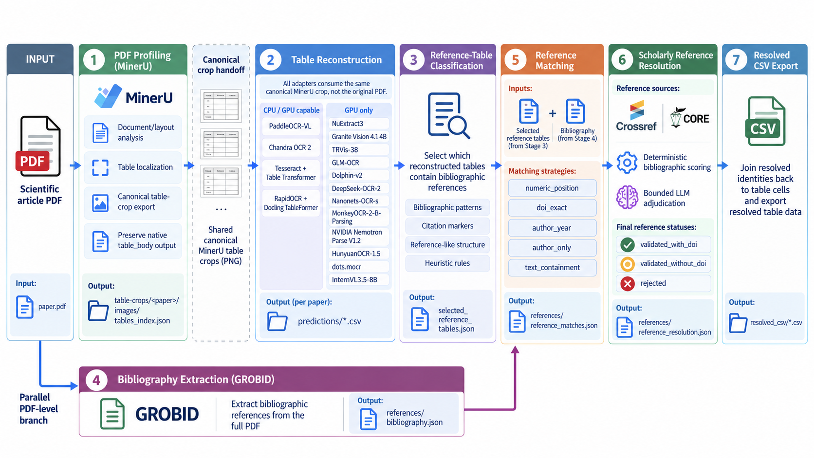

# Core Pipeline Overview

Tabulus is organized as a seven-step, artifact-oriented pipeline for
transforming scientific PDFs into structured, citation-aware table data. Each
step has a well-defined responsibility and persists its outputs on disk, so
reconstruction, reference linking, scholarly resolution, and final export
remain independently inspectable and reproducible.



Steps 1–3 form the table-processing branch: physical tables are localized,
reconstructed independently, and classified for reference-containing content.
Step 4 forms a parallel bibliography branch from the original PDF. The two
branches converge in Step 5, where table citations are linked to bibliography
positions. Step 6 resolves the corresponding scholarly identities once per
paper, and Step 7 propagates those identities back to the physical tables for
resolved CSV export. Explicit table continuations remain separate physical
entities throughout the core pipeline and may be merged only as an optional
Step 7 export operation after structural compatibility checks.

## Seven-Step Pipeline

The rebuilt `src/tabulus` package implements all seven persisted steps:

1. **PDF Profiling and Physical Table Localization:** `tabulus profile`
2. **Physical Table Reconstruction:** `tabulus reconstruct-tables`
3. **Reference-Table Classification:** `tabulus classify-reference-tables`
4. **Bibliography Extraction:** `tabulus extract-bibliography`
5. **Reference Matching:** `tabulus match-references`
6. **Scholarly Reference Resolution:** `tabulus resolve-references`
7. **Resolved CSV Export:** `tabulus export-resolved-csv`

## Canonical TabulusBench Example

When a concrete worked example is needed, the tutorial uses TabulusBench paper
`P4`:

```text
Biomedicine_And_Health/clinical_research/P4/
  P4.pdf
  reference_tables/
  bibliography/gold.json
```

Set a portable benchmark root before running examples:

```bash
export TABULUSBENCH_ROOT="/path/to/tabulusbench"
export TABULUS_WORK="/path/to/tabulus-work"
P4_PDF="$TABULUSBENCH_ROOT/Biomedicine_And_Health/clinical_research/P4/P4.pdf"
```

In this documentation, a one-paper run means processing the complete relevant
input for one paper. For `P4`, PDF-level steps operate on `P4.pdf`; table-level
benchmark examples should use all six annotated reference-containing table
inputs when benchmark crops are the appropriate input; paper-level steps
operate on complete paper-level artifacts derived from `P4`.

The benchmark's `P4/reference_tables/` directory is human gold material. It
contains six annotated reference-containing tables with adjacent `gold.csv`
files. Those tables are not necessarily every table that Step 1 profiling
will detect in the original PDF. Tabulus runs should write their own profiling
and crop artifacts outside the benchmark gold directories.

A full TabulusBench run means processing the complete applicable benchmark
input across all papers. Because TabulusBench papers are nested under
domain/subdomain directories, use an explicit `--pdf-list` for PDF-level steps
rather than `--folder` on the benchmark root. Running a step over TabulusBench
is separate from evaluating it against gold annotations: for example,
bibliography extraction can be run for every benchmark PDF even though curated
bibliography gold exists only for a subset.

The step boundaries are persisted as files:

```text
PDF
  |
  v
MinerU native output
  |
  v
canonical table-crops/<paper>/
  |-- tables_index.json
  `-- images/
        |
        v
reconstructions/<adapter>/
  |-- native/
  |-- parsed/
  |-- predictions/
  `-- batch_summary.json
        |
        v
reference_table_classification.json
selected_reference_tables.json (Step 3)

PDF
  |
  v
<artifact-root>/references/bibliography.json (Step 4)

selected_reference_tables.json + bibliography.json
  |
  v
references/reference_matches.json (Step 5; table-cell links)
  |
  v
Step 6: references/reference_resolution.json
  |
  v
Step 7: resolved_reference_tables/
  |-- <prediction-stem>_resolved.csv
  |-- resolved_tables.json
  `-- merged/                         # optional continuation merge
```

`predictions/*.csv` files remain Step 2 reconstruction outputs before reference
resolution. Step 7 never rewrites them.

## Artifact Flow

```text
Scientific PDF
      |
      +--> MinerU / PDF Profiling
      |         |
      |         +--> MinerU table_body -------------------+
      |         |                                         |
      |         +--> canonical table crops                 |
      |                   |                               |
      |                   +--> crop-consuming adapters     |
      |                   |    (OCR, document VLM,         |
      |                   |     table-structure, or hybrid routes)
      |                   v                               |
      |         adapter-native reconstruction evidence     |
      |                   |                               |
      |                   v                               |
      |         shared structural parsing / normalization  |
      |                   |                               |
      |                   +-------------------------------+
      |                                   |
      |                                   v
      |                         reconstruction candidates
      |                                   |
      |                                   v
      |                           prediction CSVs
      |                                   |
      |                  +----------------+----------------+
      |                  |                                 |
      |                  v                                 v
      |          reconstruction evaluation      reference-table classification
      |
      +--> GROBID bibliography extraction
                |
                v
          references/bibliography.json

selected_reference_tables.json + bibliography.json
      |
      v
references/reference_matches.json
      |
      v
Step 6: references/reference_resolution.json
      |
      v
Step 7: resolved physical CSV export
      |
      `--> optional safe continuation merging
```

MinerU is the current PDF profiler. It performs document/layout processing, table localization, and native table extraction. Tabulus reads MinerU output, exports the canonical table-crop handoff, and retains MinerU `table_body` as a native reconstruction candidate.

The crop-consuming reconstruction adapters currently registered in the rebuilt
library are listed in {doc}`08-table-ocr`. Each adapter receives the same
canonical MinerU crop; adapters must not independently locate or recrop tables
from the source PDF for the reconstruction comparison.

During reconstruction, adapter-native output is preserved under `native/`, then parsed through the shared Tabulus table parser into `parsed/`. A prediction CSV is written under `predictions/` only when exactly one usable parsed table is available for the physical crop.

One deterministic regex/rule classifier is applied independently to each
reconstruction method's outputs. It identifies reference-containing
reconstructed-table instances and writes `reference_table_classification.json` beside them. It does not overwrite raw reconstruction predictions.

Bibliography extraction is a separate PDF-level branch. It reads the original scientific PDF and writes normalized entries to `references/bibliography.json`; it does not consume canonical table crops or reconstruction prediction CSVs. The table and bibliography branches converge at deterministic reference matching.

Step 5 links table-cell citation tokens to bibliography positions offline.
Step 6 consumes the union of matched bibliography indices for a paper and
avoids resolving the same bibliography entry separately for every cell, table,
or reconstruction adapter. It writes a paper-level
`references/reference_resolution.json` registry after every target reaches a
final scientific status.

Step 7 joins that registry back onto the Step 5 physical-row links. Physical
resolved CSVs are the default output. Optional continuation merging uses the
Step 1 symbolic topology and revalidates structural compatibility at export
time; unsafe or incomplete groups remain separate.

## Current Versus Planned

Implemented in the rebuilt library:

- MinerU profiling through `tabulus profile`
- automatic canonical table-crop export
- standalone crop export through `tabulus export-table-crops`
- table reconstruction through `tabulus reconstruct-tables`
- registered crop-consuming reconstruction adapters listed in
  {doc}`08-table-ocr`
- shared HTML/Markdown structural parsing and deterministic OTSL-to-HTML normalization during reconstruction
- reference-table classification through `tabulus classify-reference-tables`
- GROBID-backed bibliography extraction through `tabulus extract-bibliography`
- deterministic reference matching from selected reference-like tables and
  `references/bibliography.json`
- reference matching through `tabulus match-references`
- paper-level scholarly reference resolution through `tabulus resolve-references`
- deterministic resolved CSV export through `tabulus export-resolved-csv`
- optional safe continuation merging with physical-table provenance

Future convenience work:

- run report / QA bundle
- optional monolithic `tabulus run` orchestration

## Detailed Pages

- {doc}`01-pdf-profiling`
- {doc}`08-table-ocr`
- {doc}`10-reference-table-classification`
- {doc}`11-bibliography-extraction`
- {doc}`12-reference-matching`
- {doc}`13-doi-resolution`
- {doc}`14-csv-export`
- {doc}`../modules/table-ocr-adapters`
- {doc}`../data-contracts/run-directory`
- {doc}`../data-contracts/resolved-csv`
- {doc}`../external-tools/mineru`
- External Tools pages for adapter-specific model and runtime details
