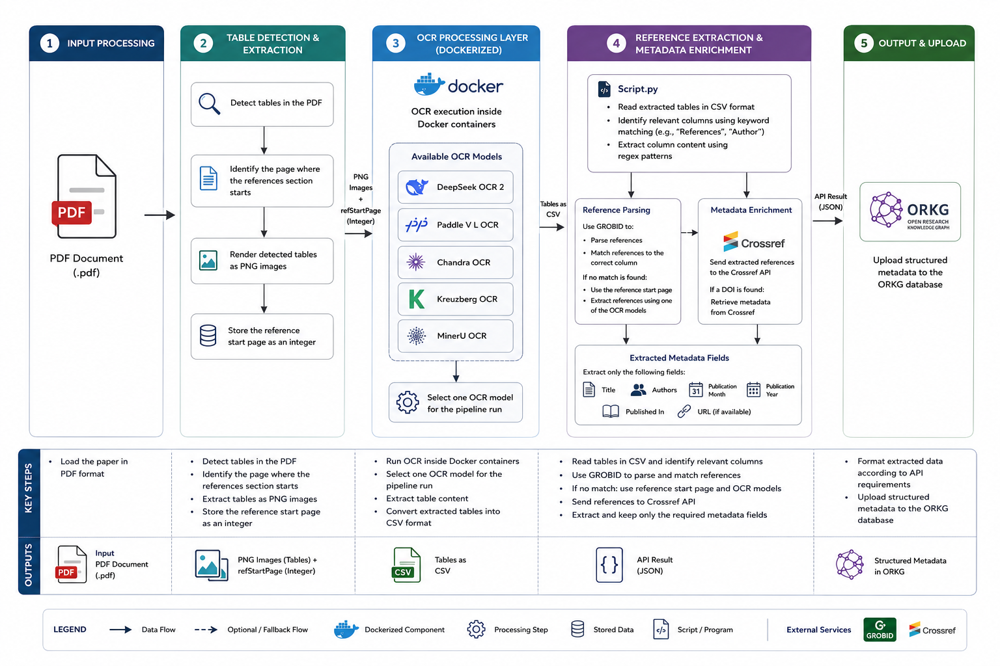

# Scientific PDF Table Extraction Pipeline

This repository contains a multi-stage pipeline for automated extraction, OCR processing, bibliography matching, and DOI enrichment of tables extracted from scientific PDF documents.

The system combines multiple OCR and document-processing technologies into a unified workflow that transforms raw scientific publications into structured machine-readable table data.

---

# Pipeline Overview



The pipeline performs the following steps:

1. Upload a scientific PDF document
2. Detect and crop tables using MinerU
3. Extract table structure and text using PaddleOCR-VL
4. Detect reference-like tables automatically
5. Extract bibliography references using GROBID
6. Match table references against bibliography entries
7. Resolve DOI information using Crossref
8. Generate enriched CSV files with DOI replacements
9. Visualize all processing stages in the web UI

---

# Pipeline Components

The project consists of several independent services.

Each component contains its own dedicated README file with detailed technical documentation, setup instructions, implementation details, API routes, and usage examples.

| Component | Description |
|---|---|
| `ui_input` | React frontend for visual pipeline interaction and result inspection |
| `backend` | Main orchestration service coordinating all pipeline stages |
| `mineru_service` | Table detection and cropping service using MinerU |
| `paddle_service` | OCR and table structure extraction using PaddleOCR-VL |
| `grobid` | Bibliography extraction and structured reference parsing |
| `kreuzberg_service` | OCR fallback service for difficult bibliography extraction cases |

---

# Main Workflow

```text
PDF Upload
    ↓
MinerU Table Detection
    ↓
Table PNG Cropping
    ↓
PaddleOCR-VL Extraction
    ↓
Reference Table Detection
    ↓
GROBID Bibliography Extraction
    ↓
Reference Matching
    ↓
Crossref DOI Resolution
    ↓
Resolved CSV Generation
```

---

# Features

- Automated scientific table extraction
- GPU-accelerated OCR processing
- Bibliography-aware reference matching
- DOI enrichment using Crossref
- Reference-table detection heuristics
- Structured CSV generation
- Interactive web interface
- Multi-container Docker architecture
- Modular microservice design

---

# Repository Structure

```text
project-root/
│
├── ui_input/
├── backend/
├── mineru_service/
├── paddle_service/
├── grobid/
├── kreuzberg_service/
│
├── docker-compose.yml
└── README.md
```

---

# Documentation

Every component contains a dedicated README file with detailed information about:

- architecture,
- Docker setup,
- API endpoints,
- implementation details,
- configuration,
- processing logic,
- internal workflow,
- dependencies,
- usage examples.

Please refer to the individual component documentation for detailed technical information.

---

# Intended Use

The pipeline was developed as part of a Master's thesis focusing on:

- scientific table extraction,
- OCR evaluation,
- bibliography-aware table processing,
- automated DOI enrichment,
- structured scientific knowledge extraction.

---

# Example Output

The pipeline produces:

- cropped table images,
- structured OCR table output,
- detected reference tables,
- bibliography matches,
- DOI-enriched CSV files,
- intermediate processing metadata.

---

# Technologies

- React
- TypeScript
- FastAPI
- Docker
- MinerU
- PaddleOCR-VL
- GROBID
- Kreuzberg OCR
- Crossref API
- Python

---

# Running the Pipeline

To start the complete pipeline locally:

1. Install Docker Desktop
2. Open a terminal
3. Navigate into the pipeline directory

```bash
cd tabulus/pipeline
```

4. Start all services using Docker Compose

```bash
docker compose up --build
```

This command automatically builds and starts:

- frontend UI,
- backend API,
- MinerU service,
- PaddleOCR-VL service,
- GROBID,
- Kreuzberg OCR fallback service.

After startup, the web UI can be accessed in the browser.

---

# Notes

This repository contains experimental research software developed for scientific evaluation and benchmarking purposes.