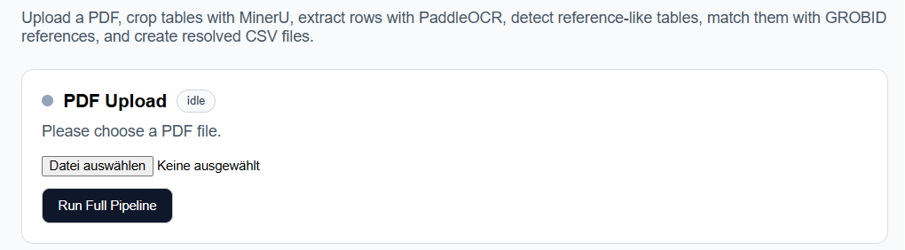
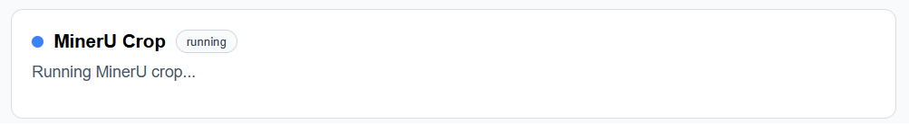
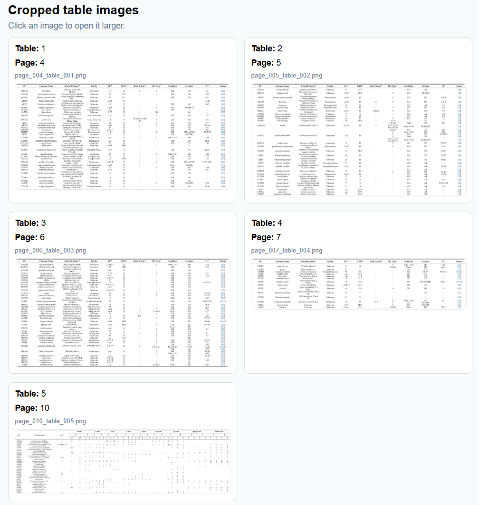
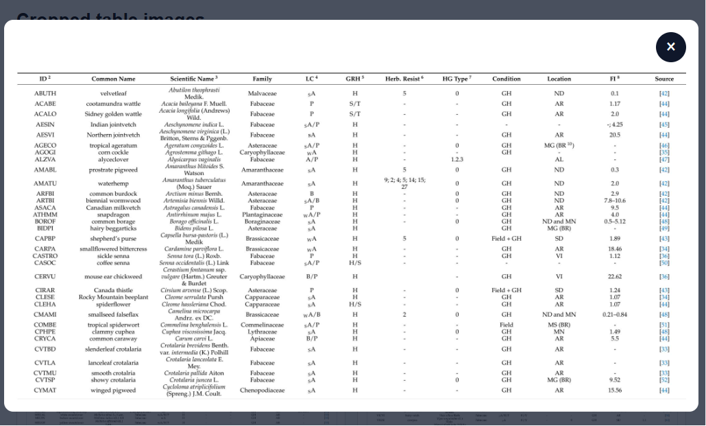
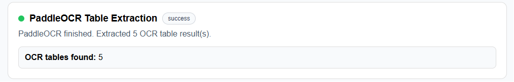
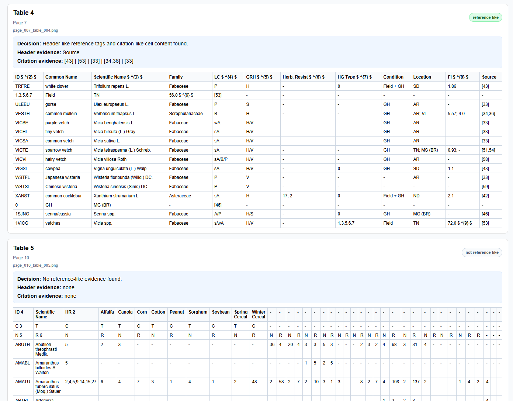
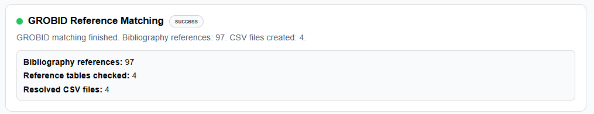
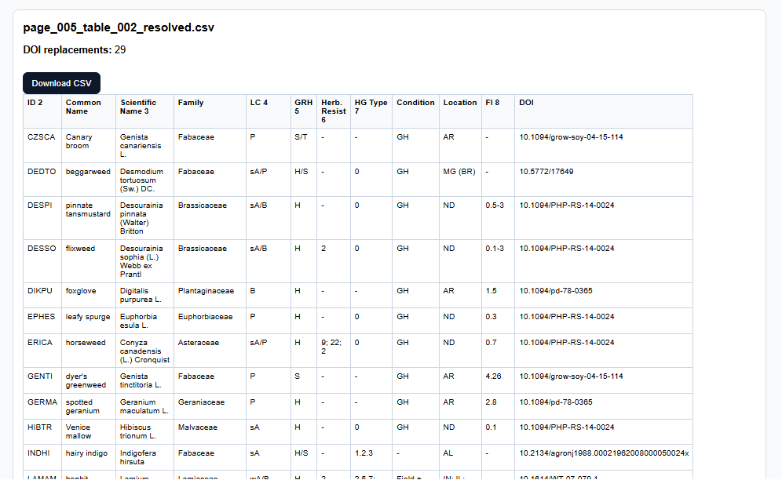

# UI Input Service

## Overview

The UI Input Service is the frontend application of the pipeline system.

It provides an interactive graphical interface for:

- uploading scientific PDFs,
- executing the complete extraction workflow,
- visualizing intermediate pipeline stages,
- inspecting OCR results,
- validating bibliography matching,
- previewing generated CSV outputs.

The frontend communicates with the backend using REST API endpoints.

---

# Pipeline Overview

```text
User
 ↓
UI Input Service
 ↓
Backend Service
 ↓
MinerU Service
 ↓
PaddleOCR Service
 ↓
GROBID / Kreuzberg Matching
 ↓
Resolved CSV Output
```

---

# Folder Structure

```text
ui_input/
├── src/
│   ├── App.tsx
│   ├── main.tsx
│   ├── PipelineFeedbackPage.tsx
│   └── PipelineFeedbackPage.module.css
│
├── images/
│   ├── ui_main.png
│   ├── ui_mineru.png
│   ├── ui_ocr.png
│   ├── ui_reference_detection.png
│   ├── ui_matching.png
│   └── ui_csv_preview.png
│
├── Dockerfile
├── package.json
├── vite.config.ts
├── tsconfig.json
├── index.html
└── README.md
```

---

# Technologies Used

| Technology | Purpose |
|---|---|
| React | Frontend framework |
| TypeScript | Type safety |
| Vite | Frontend build tool |
| CSS Modules | Component styling |
| Docker | Containerization |
| Fetch API | Backend communication |

---

# Main Features

- PDF upload
- Pipeline status visualization
- MinerU table crop preview
- OCR table rendering
- Reference-like table detection
- GROBID bibliography matching
- DOI visualization
- CSV preview and download
- Image modal preview

---

# Pipeline Workflow

## 1. PDF Upload

The user uploads a scientific PDF through the frontend interface.

The frontend validates:

- file type,
- upload state,
- pipeline execution state.

---

## 2. MinerU Table Cropping

The backend sends the PDF to the MinerU service.

MinerU:

- detects tables,
- crops table images,
- detects the references section,
- generates table metadata.

The frontend visualizes:

- cropped images,
- table count,
- references start page.

---

## 3. PaddleOCR Table Extraction

The cropped images are processed using PaddleOCR-VL.

The frontend displays:

- extracted rows,
- parsed table structure,
- OCR output preview.

---

## 4. Reference-like Table Detection

The backend classifies tables as:

- reference-like,
- or non-reference-like.

The UI visualizes:

- decision results,
- header evidence,
- citation evidence,
- classification explanation.

---

## 5. GROBID Reference Matching

The backend extracts bibliography references using GROBID.

If GROBID fails, the Kreuzberg fallback extraction is used.

The frontend visualizes:

- matched bibliography entries,
- DOI values,
- matching success,
- Kreuzberg fallback information.

---

## 6. CSV Generation

Resolved CSV files are generated.

The frontend allows:

- CSV preview,
- CSV download,
- DOI replacement inspection.

---

# UI Screenshots

---

# Main Pipeline Interface



### Description

The main interface of the UI Input Service allows users to upload scientific PDF documents and execute the complete extraction pipeline.  
The interface visualizes all processing stages, including table cropping with MinerU, OCR extraction with PaddleOCR-VL, reference-like table detection, bibliography matching with GROBID, and resolved CSV generation.
---

# MinerU Table Crop Results




### Description

The MinerU stage is responsible for detecting and cropping table regions from the uploaded scientific PDF.  
Detected tables are extracted as individual PNG images and visualized in the frontend together with metadata such as table number and page location.

The interface allows users to inspect all detected table crops before OCR processing begins.  
Each cropped table image can be enlarged through the modal preview system to verify table quality, structure, and extraction correctness.

This stage also detects the beginning of the references section in the PDF, which is later used during bibliography extraction and reference matching.

---

# OCR Table Extraction



### Description

The PaddleOCR-VL stage processes the cropped table images generated by MinerU and extracts structured table content in the form of rows and columns.

The frontend visualizes the OCR output directly as rendered tables, allowing detailed inspection of the extracted content and table structure.

In addition to OCR extraction, the backend performs a reference-like table classification step.  
Tables are analyzed for:

- reference-related header terms,
- citation patterns,
- DOI expressions,
- author-year references,
- numeric citation structures.

The interface displays the classification result together with the detected evidence and explanation for the decision.

Reference-like tables are highlighted and later forwarded to the bibliography matching stage, while unrelated tables are ignored during reference resolution.

---


# GROBID Reference Matching



### Description

The GROBID reference matching stage resolves extracted table references against the bibliography section of the scientific PDF.

The backend first extracts bibliography entries using GROBID and then compares the detected table references against the extracted bibliography references using multiple matching strategies, including:

- numeric citation matching,
- DOI matching,
- author-year matching,
- author-only matching,
- normalized text similarity matching.

For each matched reference, DOI values are extracted and inserted into the resolved CSV output.

The frontend visualizes:

- bibliography statistics,
- number of processed reference tables,
- matching results,
- resolved DOI values,
- generated CSV files.

If GROBID fails to extract bibliography entries, the Kreuzberg fallback extraction mechanism can be automatically activated to recover the reference section using OCR-based extraction and publisher-specific regex patterns.
---

# Resolved CSV Preview



### Description

The final stage of the pipeline generates resolved CSV files in which detected reference identifiers are automatically replaced with DOI values.

After the bibliography matching process is completed, the backend creates a new CSV version for every detected reference-like table.  
The original citation cells (e.g., `[43]`, `[12,15]`, or author-year references) are replaced with resolved DOI values obtained from matched bibliography entries and optional Crossref enrichment.

The frontend provides:

- downloadable resolved CSV files,
- DOI replacement statistics,
- table previews directly in the browser,
- visualization of inserted DOI values,
- side-by-side inspection of OCR extraction and final structured output.

This stage transforms semi-structured reference tables into machine-readable datasets that can later be integrated into external systems such as ORKG or further processed for scientific knowledge graph generation.

---

# API Endpoints

| Endpoint | Purpose |
|---|---|
| `POST /upload-pdf` | Upload PDF |
| `POST /jobs/{id}/run-paddle` | Run OCR |
| `POST /jobs/{id}/match-references` | Match references |
| `GET /jobs/{id}` | Get job information |
| `GET /jobs/{id}/images/{image}` | Load cropped images |
| `GET /jobs/{id}/resolved-csv/{csv}` | Download CSV |

---

# Docker Configuration

## Dockerfile

```dockerfile
FROM node:20-alpine

WORKDIR /app

COPY package*.json ./

RUN npm install

COPY . .

EXPOSE 5173

CMD ["npm", "run", "dev", "--", "--host", "0.0.0.0"]
```

---

# Run Locally

```bash
npm install
npm run dev
```

Frontend:

```text
http://localhost:5173
```

---

# Docker Build

```bash
docker build -t ui_input .
```

---

# Docker Run

```bash
docker run -p 5173:5173 ui_input
```

---

# Summary

The UI Input Service provides an interactive interface for executing and visualizing the complete scientific PDF processing workflow.

The frontend simplifies:

- OCR inspection,
- table validation,
- bibliography matching,
- DOI verification,
- CSV generation,
- debugging and evaluation of the pipeline.